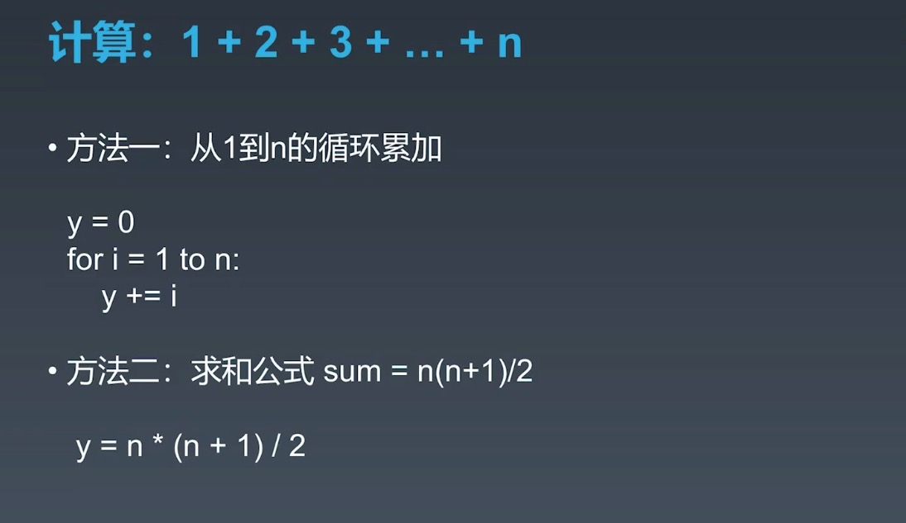
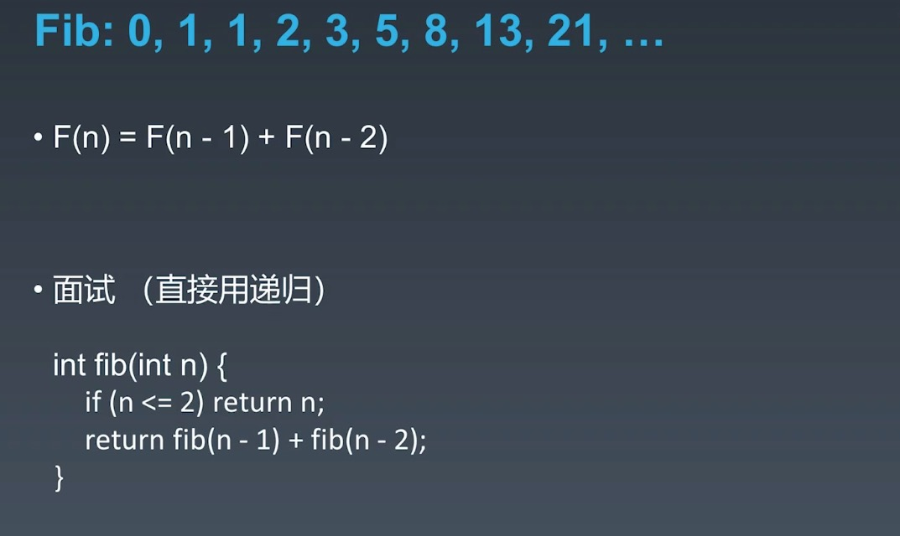
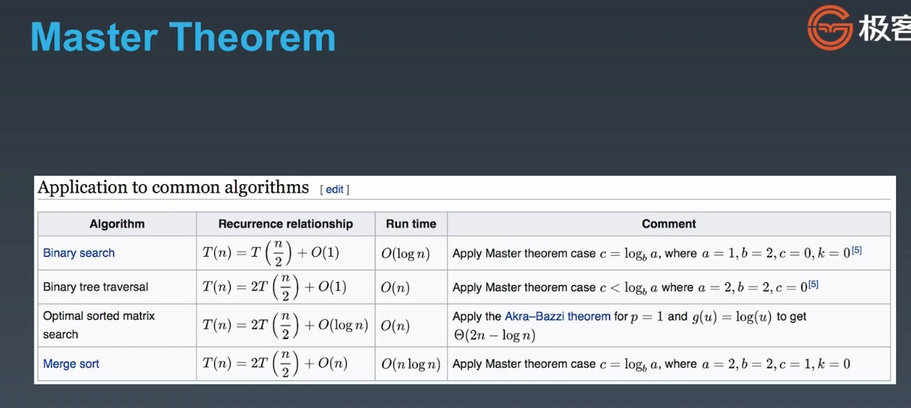

# learn-algorithm
算法学习

- Code Style
- 编程方法：自定向下
- 练习网站：[力扣](https://leetcode.cn/)

## 算法复杂度
### 时间复杂度（Time Complexity）
1. 常用时间复杂度
  - O(1): 常数
  - O(logN): 对数复杂度
  - O(n): 线性
  - O(n^2): 平方
  - O(n^3): 立方
  - O(2^n): 指数
  - O(n!): 阶乘
2. 示例
  - 求和
    
  - 斐波那契数列
   - 递归写法：O(k^n)
     
   - 优化：缓存已经计算过的
3. 主定理
  
4. 思考题
  - 二叉树遍历-前序、中序、后序：时间复杂度是多少？O(n)
  - 图的遍历：时间复杂度是多少？O(n)
  - 搜索算法：DFS、BFS时间复杂度是多少？O(n)
  - 二分查找：时间复杂度是多少？O(logN)

### 空间复杂度（Space Complexity）
